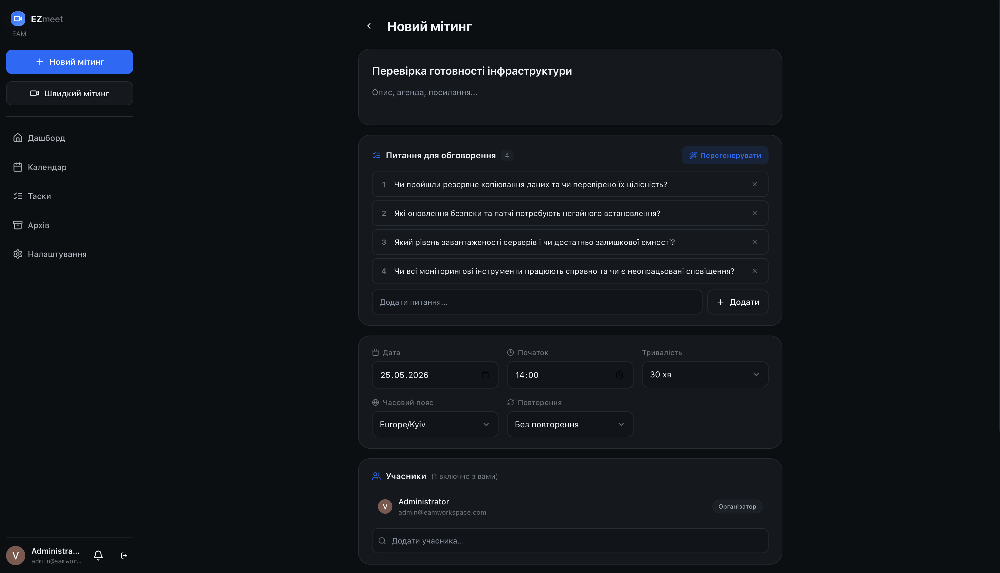
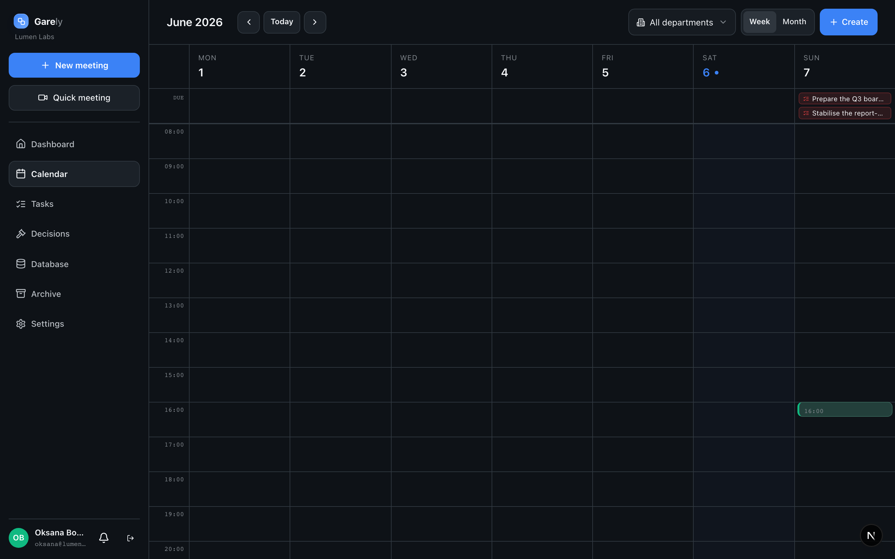
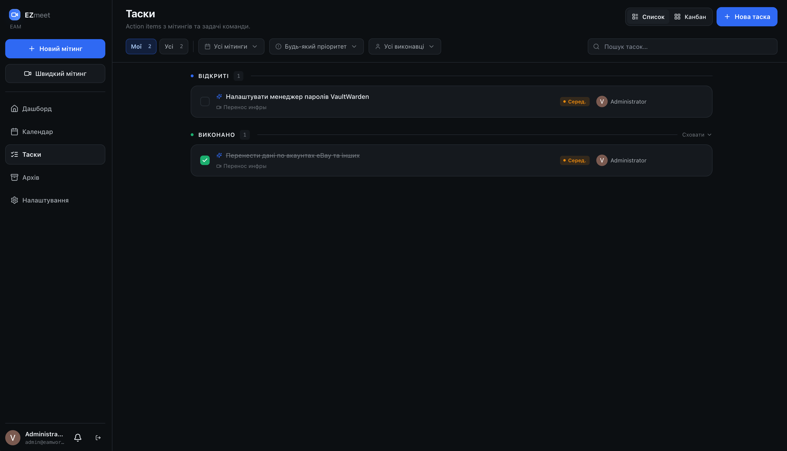
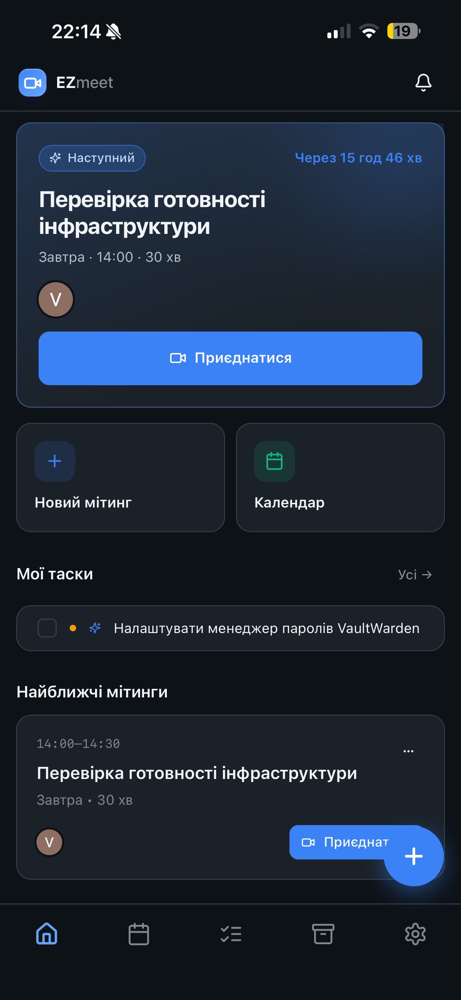
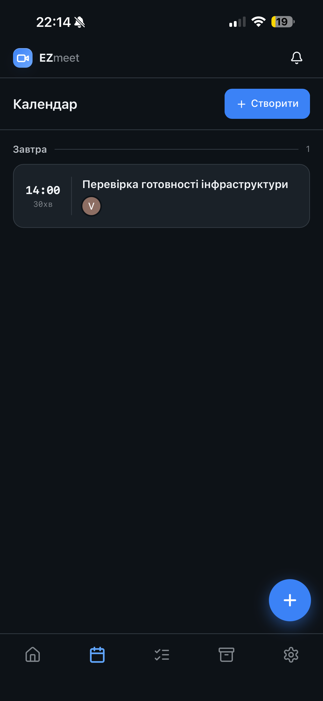
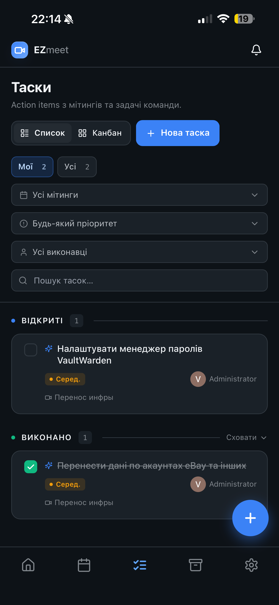

# Garely

Self-hosted video-conferencing platform with AI meeting intelligence: live
multilingual transcription, automatic summaries, action items, collaborative
notes, a report-grounded AI chat, post-meeting comprehension quizzes, and
on-demand recording.

[](https://github.com/voltergared03/garely/actions/workflows/ci.yml)
[](LICENSE)

---

## Install

On a fresh Linux server with a domain pointed at it, **one command** installs
everything — Docker, the full stack, and automatic HTTPS:

```bash
curl -fsSL https://raw.githubusercontent.com/voltergared03/garely/main/install.sh | sudo bash
```

It installs **Docker + Compose** if missing, asks for your **domain** (plus an
optional Let's Encrypt email and AI / Google keys), generates **all secrets**,
and starts the stack behind **Caddy** with an auto-provisioned TLS certificate —
then prints the link to the first-run **`/setup`** wizard. Open it, paste the
one-time token, and you're live. Re-running the command later **updates** the
install in place (secrets and config are preserved).

**Before running it:**

- Point a **DNS A-record** for your domain at the server's public IP.
- Open these ports to the internet: **`80`**, **`443`** (tcp + udp), and the
  WebRTC media ports **`3478/udp`**, **`7881/tcp`**, **`50000–50200/udp`**.
- **~2 GB RAM** minimum (**≥ 4 GB** if you'll enable recording).

> Want your own nginx/Traefik, a custom layout, or no installer? Use the
> [manual install](#manual-install) instead.

---

## Screenshots

**Desktop**





**Mobile** — installable PWA

<p align="left">
  
  
  
</p>

---

## Features

- **Video meetings** over WebRTC (LiveKit SFU): guest join links + waiting room, screen share, reactions, **start now** or schedule
- **Per-speaker multilingual live transcription** (Deepgram, uk / ru / en) streamed into the room
- **AI post-meeting reports** (DeepSeek): summary, decisions, action items & follow-ups — plus a topic-structured **"Detailed" report** with clickable transcript citations and PDF export
- **Report-grounded AI chat** — ask questions about the meeting; answers cite the transcript
- **Post-meeting comprehension quizzes** — generate AI questions from a report, assign to attendees, auto-graded, with a scores & answers hub
- **Task workspace** — a board (list / kanban / by-department) where **subtasks** are managed inline (expand a row to toggle, reassign, delete or quick-add, with a progress meter), plus **comments**, **file attachments** and **collaborators** in a side panel; deadlines land on the calendar
- **Departments** — group people into teams; meetings & tasks belong to a department, which gates who sees what (members see their own + their department's + collaborated work; admins see all)
- **Calendar sync** — subscribe to your own meetings & task deadlines (private ICS feed) from Google Calendar, Outlook or Apple Calendar
- **Collaborative notes** with @mentions, **recurring meetings**
- **On-demand recording** via LiveKit Egress — start / stop from an in-meeting button (host/admin); see [Recording](#recording-livekit-egress)
- **Auth**: Google SSO and/or **email + password** (toggle per workspace), optional **2FA (TOTP)** for admins, admin-managed users + optional **self-registration with approval**
- **Notifications**: in-app, **Web Push** (delivered even when the app/tab is closed) + email (meeting invitations with `.ics`, task assigned / updated, meeting reminders, weekly digest, report-ready, mentions)
- **Installable PWA**: add to home screen, app icons & shortcuts, offline fallback page
- **Admin panel**: users, workspace policies, integrations, usage/cost
- **First-run setup wizard** (`/setup`): configure auth methods, branding & integrations from the browser — zero config-file editing
- **Bilingual** (English / Ukrainian): admin sets the workspace language at setup; each user can switch their own interface language in Settings

## Languages

Garely ships **bilingual — English (default) and Ukrainian**:

- The **workspace language** is the very first choice in the `/setup` wizard. It's the
  default interface language for everyone **and** the language of all *generated content*:
  AI agendas & task descriptions, post-meeting reports, emails (reminders, weekly digest,
  report-ready, invites) and notifications.
- Each user can override **their own interface language** anytime in **Settings** — that
  changes only the UI chrome for them; generated content stays in the workspace language.

Internationalized with [`next-intl`](https://next-intl.dev); adding another locale is a
matter of dropping in a `messages/<locale>.json` catalog.

## Tech stack

| Layer | Tech |
|---|---|
| Frontend / SSR | Next.js 15 (App Router), React 19, TypeScript |
| Auth | NextAuth v5 (Google SSO, JWT) + TOTP 2FA |
| ORM / DB | Prisma 6 + PostgreSQL 16 |
| Realtime / media | LiveKit (SFU) + LiveKit Egress (recording) |
| Agent | Python (`livekit-agents`) — STT + LLM |
| STT / LLM | Deepgram / DeepSeek |
| Cache / coordination | Redis 7 (LiveKit + Egress) |
| Email / storage | SMTP (nodemailer) / S3-compatible (optional) |
| PWA / push | Web App Manifest + service worker + Web Push (VAPID, `web-push`) |
| Infra | Docker Compose, Caddy *or* nginx (TLS reverse proxy) |

---

## Architecture

Services defined in `docker-compose.yml`:

| Service | Role |
|---|---|
| `eam-meet` | Next.js app (API + UI), published on `127.0.0.1:3100` |
| `livekit` | LiveKit SFU (WebRTC) |
| `egress` | LiveKit Egress — records rooms to `/recordings` (a shared volume) |
| `livekit-agent` | Python agent — transcription + AI report |
| `eam-meet-db` | PostgreSQL 16 |
| `eam-meet-redis` | Redis — LiveKit ↔ Egress coordination |

The one-command [installer](#install) adds a **Caddy** container
(`docker-compose.caddy.yml`) that terminates TLS with an automatic Let's Encrypt
certificate and routes `/livekit/*` → LiveKit, everything else → the app.
Alternatively, front Garely with your own host reverse proxy (terminate TLS,
forward `/` → `127.0.0.1:3100` and `/livekit/` + `/twirp/` → LiveKit on
`127.0.0.1:7880`); a sample nginx config is in [`app/nginx.conf`](app/nginx.conf).

---

## Prerequisites

- A **Linux server** — the installer adds **Docker + Compose** if they're missing
- A **domain name** with a DNS A-record pointing at the server (e.g. `meet.example.com`)
- **TLS** — issued automatically by the installer's **Caddy** proxy, or bring your own (nginx + certbot)
- A **Google OAuth 2.0 client** for SSO — *optional*, can be added later in `/setup`
- **Deepgram** (STT) + **DeepSeek** (LLM) API keys for AI features — *optional*, add later in admin → Settings
- **RAM**: ~2 GB for app + LiveKit + agent. **Recording adds ~2 GB** while a
  recording is active (Egress runs headless Chrome). Plan for ≥ 4 GB if you
  intend to enable recording, or keep it disabled.

---

## Manual install

Prefer to set things up yourself, or front Garely with your own reverse proxy?
The whole stack is plain Docker Compose:

```bash
git clone https://github.com/voltergared03/garely.git && cd garely

# 1. Secrets / config (never commit the real files — they are gitignored)
cp .env.example .env                     # fill in all values
cp livekit.example.yaml livekit.yaml     # set the API key/secret + redis password
cp egress.example.yaml egress.yaml       # MUST match livekit.yaml's key/secret + redis password

# 2. Build & start
docker compose up -d --build

# 3. Create the database schema (first run only)
docker compose exec eam-meet npx prisma db push

# 4. Restart so the app prints a one-time setup token, then read it
docker compose restart eam-meet
docker compose logs eam-meet | grep -A2 SETUP
```

Then finish setup in the browser — no SQL, no config files:

1. Open `https://<your-domain>/setup`
2. Paste the **setup token** from the logs above
3. Set the workspace **name + domain**, then pick your **sign-in method(s)** —
   **Google SSO**, **email + password**, or both
4. Create the first **admin**: sign in with Google (the wizard shows the exact
   redirect URI to authorize in Google Cloud Console) *or* create an email +
   password admin inline. Either way `/setup` locks itself permanently afterward

Optional services (SMTP, Deepgram, DeepSeek, S3) are configured afterwards from
the dashboard **setup checklist** or admin **Settings** — the app already runs
without them.

### Matching secrets (important)

Three values must be **identical** across files or LiveKit/Egress won't work:

| Value | Goes in |
|---|---|
| LiveKit API secret | `.env` (`LIVEKIT_API_SECRET`), `livekit.yaml` (`keys.EAM_MEET_KEY`), `egress.yaml` (`api_secret`) |
| Redis password | `.env` (`REDIS_PASSWORD`), `livekit.yaml` (`redis.password`), `egress.yaml` (`redis.password`) |
| `NEXTAUTH_SECRET` | `.env` only (used for sessions, 2FA, and internal webhook auth) |

### Google OAuth

Create an OAuth 2.0 **Web** client in Google Cloud Console. You don't need to
touch `.env` for this — the first-run **/setup** wizard displays the exact
redirect URI to authorize and lets you paste the client ID/secret there (saved
to the database). Env vars (`GOOGLE_CLIENT_ID` / `GOOGLE_CLIENT_SECRET`) still
work as a fallback if you prefer.

### Reverse proxy (TLS)

Use [`app/nginx.conf`](app/nginx.conf) as a starting point — replace the
`server_name` and certificate paths with your domain. It proxies `/` → app
(`127.0.0.1:3100`) and `/rtc` + `/twirp` → LiveKit (`127.0.0.1:7880`). Obtain
certs with certbot (`certbot --nginx -d meet.example.com`).

---

## Authentication

Two sign-in methods, toggled per workspace in the **/setup** wizard or later in
**Admin → Settings → Sign-in methods** (saved instantly). At least one stays
active at all times, and the workspace **won't let you disable a method that
would lock every admin out** — e.g. turning off Google SSO while no admin has a
password yet.

| Method | Notes |
|---|---|
| **Google SSO** | OAuth 2.0 via NextAuth. On by default when Google credentials are present. |
| **Email + password** | Passwords hashed with **scrypt** (no external service). Off by default. |

**Admin-provisioned users** (Admin → Users → invite) get a temporary password
and are forced to set their own on first login; an email is sent if SMTP is
configured. Admins can **reset** a user's password (Admin → Users → key icon),
and anyone can **set or change their own** under **Profile → Security** — so a
Google-only account can add a password before switching sign-in methods.

### Self-registration (optional)

With email + password enabled, you can let people request their own account.
Requests are **never** auto-approved:

- They appear in **Admin → Users → Registration requests** to approve or deny.
- The applicant sets their own password when requesting; approval activates the
  account as-is.
- Optionally restrict sign-ups with an **email-domain allowlist**.
- Pending requests **expire after 3 days** (configurable) and are swept by the
  hourly `reg-cleanup` cron (see [Scheduled jobs](#recording-livekit-egress)).

> **Backward-compatible:** existing SSO-only deployments are untouched — password
> auth and self-registration remain **off** until an admin enables them.

---

## Configuration

**`.env`** — bootstrap secrets only (DB, Redis, NextAuth, LiveKit, URLs,
`CRON_SECRET`). Google SSO, Deepgram and DeepSeek are *optional* here — they're
normally set in the **/setup** wizard / admin panel. See [`.env.example`](.env.example).

**Runtime config** lives in the database (`SystemConfig` table), set by the
first-run **/setup** wizard and edited later in the **admin panel** (Settings):

| Group | Keys |
|---|---|
| API | `DEEPSEEK_*`, `DEEPGRAM_*` (key / model / language / base URL) |
| Auth | `GOOGLE_CLIENT_ID/SECRET`, `AUTH_GOOGLE_ENABLED`, `AUTH_PASSWORD_ENABLED`, `AUTH_SELFREG`, `AUTH_SELFREG_DOMAINS`, `AUTH_REQUEST_TTL_DAYS` |
| SMTP | `SMTP_HOST/PORT/SECURE/USER/PASS/FROM/FROM_NAME` |
| Workspace | `WS_NAME/TIMEZONE/LANGUAGE/GUEST_ACCESS/AI_SUMMARY/LIVE_TRANSCRIPTION/RECORD_ALL/REQUIRE_2FA/MAX_PARTICIPANTS/MAX_DURATION_MIN/RETENTION_DAYS` |
| Pricing | `PRICE_DEEPSEEK_IN/OUT`, `PRICE_DEEPGRAM_MIN`, `EMAIL_LIMIT` |
| S3 (optional) | `S3_ENDPOINT/REGION/BUCKET/ACCESS_KEY/SECRET_KEY/FORCE_PATH_STYLE` |

---

## Notifications & PWA

The app installs as a **Progressive Web App** (manifest + service worker) and
supports **Web Push**, so meeting reminders, task assignments, report-ready and
@mentions reach users even when the tab or installed app is closed.

**Push setup is automatic.** A VAPID keypair is generated on first boot and
stored in `SystemConfig` (`VAPID_PUBLIC_KEY` / `VAPID_PRIVATE_KEY`) — no config
files to edit. Push requires HTTPS (already needed for the app). Users opt in
**per device** from **Settings → Notifications** or the bell's prompt.

- **iOS**: push works on iOS 16.4+ **only after** the user installs the PWA
  ("Add to Home Screen").
- **Subject**: pushes use `mailto:admin@<your-domain>`; override with the
  optional `VAPID_SUBJECT` env / config key for a different contact.
- **Offline**: the service worker caches static assets and serves an offline
  fallback page; live routes (`/room`, `/lobby`, `/api`) always hit the network
  and are never cached.

In-app notifications and push share the server's `notify()` helper — push is
just an extra delivery channel, so nothing else needs wiring.

---

## Recording (LiveKit Egress)

The `egress` service records the room (grid composite) to MP4 files in a shared
Docker volume (`eam-meet-recordings`, mounted at `/recordings`), served back
through the app's report card (play / download / keep / delete).

- **On-demand.** A host/admin starts and stops recording from a **Record button
  inside the meeting**, so the egress container stays idle otherwise. The optional
  **Admin → Workspace** `WS_RECORD_ALL` setting (off by default) auto-starts
  recording when a meeting goes live.
- **Retention**: set `WS_RETENTION_DAYS` (0 = keep indefinitely). A daily cron
  (`/api/cron/recordings`) deletes expired, non-permanent recordings.
- **Resource cost**: each active recording launches a headless Chrome
  (~1.5–2 GB RAM, ~1–2 CPU). Size your server accordingly.
- Egress requires the shared **Redis** (already wired in `docker-compose.yml` +
  the `redis:` blocks of `livekit.yaml` / `egress.yaml`).

**Scheduled jobs are built in.** A small `cron` service (`docker-compose.yml`)
runs them against the app's internal API — there's no host crontab to edit:

| Job | Schedule | Endpoint |
|---|---|---|
| Meeting reminders | every 5 min | `/api/cron/reminders` |
| Weekly digest | Mon 09:00 | `/api/cron/digest` |
| Recording retention | daily 03:00 | `/api/cron/recordings` |
| Registration cleanup | hourly | `/api/cron/reg-cleanup` |
| State cleanup (stale meetings / stuck recordings) | every 30 min | `/api/cron/cleanup` |
| Recurring meetings (materialize next occurrence) | hourly | `/api/cron/recurrence` |

Each request is authenticated with `CRON_SECRET` from `.env`; follow runs with
`docker compose logs -f cron`. Schedules use the container clock (UTC unless you
set `TZ` on the service).

---

## Data & backups

All persistent state lives in named Docker volumes:

| Volume | Holds |
|---|---|
| `eam-meet-pgdata` | PostgreSQL — **all** users, meetings, reports, tasks |
| `eam-meet-recordings` | meeting recordings (MP4) |
| `eam-meet-speaker-audio` | per-speaker audio (re-transcription) |
| `eam-meet-task-files` | task attachment uploads |
| `eam-meet-redis-data` | Redis coordination state (transient) |
| `eam-meet-backups` | automatic daily database dumps (last 14) |

> [!WARNING]
> `docker compose down -v` **deletes these volumes — including the entire
> database.** To stop the stack use plain `docker compose down` (or `stop`);
> the `-v` flag is destructive and unrecoverable.

**Automatic backups.** The `db-backup` service writes a rotated `pg_dump` to the
`eam-meet-backups` volume once a day (keeping the last 14) — follow it with
`docker compose logs -f db-backup`. These live on the **same host**, so for real
disaster recovery copy them off-box, e.g.:

```bash
docker compose cp db-backup:/backups ./garely-backups   # pull all dumps
```

To take an immediate manual dump:

```bash
docker compose exec -T eam-meet-db sh -c 'pg_dump -U "$POSTGRES_USER" "$POSTGRES_DB"' \
  | gzip > garely-db-$(date +%F).sql.gz
```

## Updating

```bash
git pull
docker compose build && docker compose up -d
# If the Prisma schema changed:
docker compose exec eam-meet npx prisma db push
```

> [!IMPORTANT]
> `prisma db push` reconciles the database to match the schema and **can drop
> columns/tables** when a field is renamed or removed. **Always take a backup
> first** (see [Data & backups](#data--backups)) — the `db-backup` sidecar keeps
> daily dumps, but run a manual one right before a schema change to be safe.

> **Upgrading an instance created before the `/setup` wizard?** It's auto-detected
> as already configured (an admin exists + Google credentials are present), so the
> wizard won't lock your working deployment. To set the flag explicitly:
>
> ```sql
> INSERT INTO "SystemConfig" (key, value, "updatedAt")
> VALUES ('SETUP_COMPLETE', 'true', now())
> ON CONFLICT (key) DO UPDATE SET value = 'true';
> ```

---

## Development

See [`CONTRIBUTING.md`](CONTRIBUTING.md) for local setup, testing and code
conventions, and [`CHANGELOG.md`](CHANGELOG.md) for release history.

```bash
cd app
npm install
npm run dev            # http://localhost:3000
npm test               # unit + integration (vitest)
npm run test:coverage  # coverage of the server libs + API routes
```

---

## Security notes

- Real secrets live only in `.env`, `livekit.yaml`, `egress.yaml` — all
  **gitignored**. Commit only the `*.example` templates.
- Email/password sign-in hashes passwords with **scrypt** (Node `crypto`, no
  external service) and is rate-limited per account. Self-registration is
  rate-limited per IP, supports a domain allowlist, avoids account enumeration,
  and always requires explicit admin approval.
- 2FA (TOTP) can be required for admins via `WS_REQUIRE_2FA`. Lockout recovery:
  `UPDATE "User" SET "totpEnabled"=false, "totpSecret"=NULL, "totpBackupCodes"=NULL WHERE email='…';`
- Rotating `NEXTAUTH_SECRET` invalidates all sessions **and** all 2FA secrets /
  backup codes.
- Internal endpoints (transcript/report webhooks, key sync) are authenticated
  with a shared header derived from `NEXTAUTH_SECRET`; the agent sends it
  automatically.

---

## License

Garely is licensed under the **GNU Affero General Public License v3.0** — see
[`LICENSE`](LICENSE). You're free to use, study, modify and self-host it; if you
run a modified version as a network service, you must make your source available
to its users under the same license.
